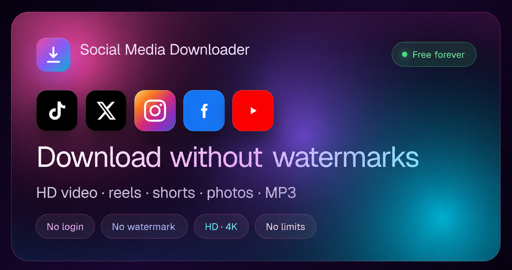

# Social Media Downloader

> Tải video TikTok, Twitter/X, Instagram, Facebook và YouTube không dính watermark — hỗ trợ video HD, Reels, Shorts, MP3, bài đăng nhiều ảnh (carousel) và video slideshow MP4 được render bằng ffmpeg. Miễn phí, không cần đăng nhập, không giới hạn.


[](https://deepwiki.com/NhanVo288/social-downloader)
[](https://nextjs.org)
[](https://react.dev)
[](https://www.typescriptlang.org)
[](https://tailwindcss.com)
[](LICENSE)

---

Một ứng dụng tải video miễn phí, không watermark dành cho TikTok, Twitter/X, Instagram, Facebook và YouTube. Chỉ cần dán liên kết, bạn có thể tải:

- Video HD
- Reel hoặc Short
- Âm thanh MP3
- Bài đăng nhiều ảnh (tải từng ảnh hoặc dưới dạng ZIP)
- Video slideshow MP4 hoàn chỉnh với nhạc nền gốc

Không cần đăng nhập, không cần cài đặt, hoạt động hoàn toàn trên trình duyệt.

Đây là một giải pháp mã nguồn mở, miễn phí thay thế cho SnapTik, SSSTik, SaveTT, SnapInsta, Y2mate và GetFvid — không quảng cáo, không theo dõi người dùng và sử dụng nhiều nguồn dự phòng (fallback) để việc tải xuống vẫn hoạt động ngay cả khi một nhà cung cấp gặp sự cố.

Được xây dựng bằng **Next.js 16**, **React 19**, **TypeScript**, **Tailwind CSS 4** và **Motion**.

---

## Tính năng

### TikTok

- Tải video HD không dính watermark.
- Trích xuất nhạc nền thành tệp MP3 (trả về với `audio/mpeg`).
- Hỗ trợ bài đăng nhiều ảnh (slideshow):
  - Xem trước từng ảnh.
  - Tải từng ảnh riêng lẻ hoặc nén thành ZIP.
  - Giữ nguyên nhạc nền gốc.
- Có thể render slideshow TikTok thành video MP4 thực bằng ffmpeg khi TikTok chỉ cung cấp ảnh.

---

### Twitter / X

- Trích xuất video trực tiếp từ mọi liên kết trạng thái (`status`) của `twitter.com` hoặc `x.com`.

---

### Instagram

- Tải Reels và video bài đăng với chất lượng gốc.
- Lưu bài đăng một ảnh hoặc nhiều ảnh (carousel), tải từng ảnh hoặc dưới dạng ZIP.
- Trích xuất âm thanh từ Reel thành MP3.
- Hỗ trợ các liên kết:

  - `instagram.com/p/...`
  - `instagram.com/reel/...`
  - `instagram.com/tv/...`
  - Link chia sẻ

  Không cần đăng nhập.

---

### YouTube

- Tải video và Shorts dưới dạng MP4 chất lượng HD.
- Trích xuất âm thanh thành MP3.
- Tự động lấy metadata như:
  - Tiêu đề
  - Tên kênh
  - Thumbnail
- Metadata được lấy từ dịch vụ oEmbed công khai của YouTube.
- Hỗ trợ:
  - `youtube.com/watch?v=...`
  - `youtu.be/...`
  - `youtube.com/shorts/...`
  - `youtube.com/embed/...`

---

### Facebook

- Tải video công khai, Watch và Reels với chất lượng HD.
- Trích xuất âm thanh thành MP3.
- Tự động xử lý:
  - Link rút gọn `fb.watch/...`
  - Link chia sẻ `/share/...`
- Hỗ trợ:
  - `facebook.com/.../videos/...`
  - `facebook.com/watch/?v=...`
  - `facebook.com/reel/...`

---

### Trải nghiệm người dùng

- Xem trước video và hình ảnh trực tiếp trước khi tải.
- Chuỗi fallback nhiều nguồn cho từng nền tảng, giúp tăng độ ổn định khi một nguồn ngừng hoạt động.
- Các API proxy hỗ trợ CORS giúp tải media ổn định, bao gồm cả CDN của Instagram vốn chặn hotlink.
- Kiểm tra URL ngay khi nhập.
- Hiệu ứng chuyển động mượt mà.
- Giao diện responsive trên mọi thiết bị.
- SEO tối ưu cho production:
  - OpenGraph động
  - Twitter Card
  - JSON-LD (WebSite, Person, SoftwareApplication, HowTo, FAQPage)
  - hreflang
  - sitemap
  - manifest tối ưu cho cài đặt như PWA
- Không cần đăng ký tài khoản.
- Không cần API Key.
- Không giới hạn số lượt tải.

---

## Công nghệ sử dụng

| Thành phần | Công nghệ |
|------------|-----------|
| Framework | Next.js 16 (App Router), React 19 |
| Ngôn ngữ | TypeScript 6 |
| Giao diện | Tailwind CSS 4 |
| Animation | Motion (trước đây là Framer Motion) 12 |
| HTTP Client | Axios |
| HTML Scraping | Cheerio |
| Nén ZIP | JSZip |
| Render slideshow | fluent-ffmpeg + @ffmpeg-installer |
| Dynamic Open Graph | @vercel/og (Edge Runtime) |
| Analytics | Vercel Analytics |


## Hướng dẫn sử dụng

### Tải video, Reel hoặc Short

1. Sao chép liên kết video từ TikTok, Twitter/X, Instagram, Facebook hoặc YouTube.
2. Dán liên kết vào ô nhập trên trang chủ.
3. Nhấn **Process URL** để ứng dụng phân tích liên kết và lấy metadata cùng liên kết tải xuống.
4. Xem trước nội dung (nếu muốn), sau đó nhấn **Video** hoặc **Extract Audio** để tải về.

---

### Tải bài đăng nhiều ảnh (Photo Carousel)

1. Dán liên kết bài đăng ảnh (TikTok Slideshow hoặc Instagram Carousel).
2. Tất cả ảnh sẽ hiển thị dưới dạng lưới để bạn xem trước.
3. Chọn những ảnh muốn tải.
4. Tải từng ảnh riêng lẻ hoặc tải tất cả dưới dạng tệp ZIP.
5. Đối với TikTok Slideshow, nhấn **Video (Slideshow)** để render thành video MP4 với thời lượng mỗi ảnh khớp cùng nhạc nền gốc.

---

### Các định dạng URL được hỗ trợ

| Nền tảng | Định dạng |
|----------|-----------|
| TikTok | `tiktok.com/@user/video/...`, `vm.tiktok.com/...`, `vt.tiktok.com/...`, `m.tiktok.com/v/...`, `tiktok.com/t/...` |
| Twitter/X | `twitter.com/user/status/...`, `x.com/user/status/...`, `t.co/...` |
| Instagram | `instagram.com/p/...`, `instagram.com/reel/...`, `instagram.com/tv/...`, `instagram.com/share/...` |
| YouTube | `youtube.com/watch?v=...`, `youtu.be/...`, `youtube.com/shorts/...`, `youtube.com/embed/...` |
| Facebook | `facebook.com/.../videos/...`, `facebook.com/watch/?v=...`, `facebook.com/reel/...`, `fb.watch/...` |

---

# Cấu trúc dự án

```text
src/
├── app/
│   ├── page.tsx                 # Trang chủ (useReducer + Motion)
│   ├── layout.tsx               # Root Layout, Metadata, JSON-LD
│   ├── opengraph-image.tsx      # Sinh ảnh Open Graph động (1200×630)
│   ├── twitter-image.tsx        # Sinh ảnh Twitter Card
│   ├── robots.ts                # robots.txt (bao gồm chính sách AI crawler)
│   ├── sitemap.ts               # sitemap.xml + hreflang + ảnh Open Graph
│   ├── globals.css
│   └── api/
│       ├── download/            # POST: Phân tích URL và trả về thông tin media
│       ├── video/               # GET : Proxy luồng video (video/mp4)
│       ├── audio/               # GET : Proxy âm thanh (audio/mpeg)
│       ├── image/               # GET : Proxy một ảnh (CORS + CDN Referer)
│       ├── images/              # POST: Tải nhiều ảnh hoặc tạo ZIP
│       └── slideshow/           # POST: Render slideshow thành MP4 bằng ffmpeg

├── components/
│   ├── icons.tsx
│   ├── ImageLightbox.tsx
│   └── ui/
│       └── accordion.tsx

├── config/
│   └── site.ts                  # Nơi quản lý metadata của toàn bộ website

└── lib/
    ├── downloader.ts            # Logic tải xuống cho TikTok, X, Instagram, YouTube, Facebook
    ├── validator.ts             # Kiểm tra URL và nhận diện nền tảng
    ├── proxyHeaders.ts          # Xử lý Referer cho từng CDN
    ├── appReducer.ts            # State machine phía Client
    ├── audioExtractor.ts        # Hỗ trợ trích xuất âm thanh
    ├── videoProcessor.ts        # Các tiện ích xử lý video
    ├── structuredData.ts        # Sinh Schema.org JSON-LD
    ├── types.ts                 # Các kiểu dữ liệu dùng chung
    └── utils.ts
```

### Mô tả kiến trúc

Dự án sử dụng **Next.js App Router**, trong đó:

- `app/` chứa toàn bộ route và API của ứng dụng.
- `components/` chứa các component tái sử dụng.
- `config/` quản lý cấu hình chung như metadata, tên website và SEO.
- `lib/` chứa toàn bộ business logic như:
  - xử lý URL,
  - tải video,
  - proxy media,
  - render slideshow,
  - tạo dữ liệu có cấu trúc (JSON-LD),
  - và các tiện ích dùng chung.

Toàn bộ API đều được triển khai dưới dạng **Route Handler** của Next.js, vì vậy không cần Express hay một backend riêng.

## API Reference

### `POST /api/download`

Phân tích URL của TikTok, Twitter/X, Instagram, Facebook hoặc YouTube, sau đó trả về metadata và các liên kết tải xuống.

**Request**

```json
{
  "url": "https://www.instagram.com/reel/ABC123/"
}
```

---

### Phản hồi khi là video

```json
{
  "success": true,
  "downloadUrl": "/api/video?url=...",
  "audioUrl": "/api/audio?url=...",
  "metadata": {
    "title": "...",
    "author": "...",
    "thumbnail": "...",
    "platform": "instagram"
  }
}
```

| Trường | Mô tả |
|---------|--------|
| success | Trạng thái xử lý |
| downloadUrl | URL tải video |
| audioUrl | URL tải âm thanh MP3 |
| metadata | Thông tin của video |

---

### Phản hồi khi là bài đăng nhiều ảnh

```json
{
  "success": true,
  "metadata": {
    "title": "...",
    "author": "...",
    "platform": "instagram",
    "images": [
      "...",
      "..."
    ]
  }
}
```

`images` là danh sách URL ảnh dùng để xem trước hoặc tải xuống.

---

## `GET /api/video?url=<encoded>`

Proxy luồng video và trả về với `Content-Type: video/mp4`.

Endpoint này sẽ tự động:

- Thêm `Referer` phù hợp cho CDN của:
  - TikTok
  - Tikwm
  - Twitter/X
  - Instagram
  - Facebook
  - YouTube
- Hỗ trợ HTTP Range Request giúp:
  - tua video (seek)
  - xem trước (preview)
  - phát trực tiếp (streaming)

---

## `GET /api/audio?url=<encoded>`

Hoạt động tương tự `/api/video`, nhưng trả về:

```
Content-Type: audio/mpeg
```

Nhờ đó trình duyệt sẽ tự hiểu đây là tệp âm thanh MP3 để tải xuống.

---

## `GET /api/image?url=<encoded>`

Proxy một ảnh và tự động:

- thêm Referer phù hợp với CDN
- thêm CORS Header

Điều này đặc biệt cần thiết vì CDN của Instagram không cho phép trình duyệt truy cập trực tiếp từ domain khác (cross-origin).

Nhờ endpoint này, ảnh Instagram có thể:

- xem trước
- tải từng ảnh riêng lẻ

---

## `POST /api/images`

Tải nhiều ảnh cùng lúc.

Tùy theo tham số `asZip`, API sẽ:

- trả về danh sách URL ảnh
- hoặc tạo một file ZIP chứa toàn bộ ảnh

Ví dụ:

```json
{
  "imageUrls": [
    "https://..."
  ],
  "title": "post-title",
  "asZip": true
}
```

---

## `POST /api/slideshow`

Render slideshow TikTok thành video MP4 bằng **ffmpeg**.

Ví dụ:

```json
{
  "imageUrls": [
    "https://...",
    "https://..."
  ],
  "audioUrl": "https://...",
  "perImageSeconds": 3
}
```

API sẽ:

- tải toàn bộ ảnh
- tải nhạc nền
- ghép ảnh theo thời lượng chỉ định
- chèn nhạc gốc
- xuất thành video MP4 hoàn chỉnh

---

# Thứ tự Fallback

Để tăng độ ổn định, ứng dụng sẽ thử nhiều nguồn khác nhau theo thứ tự. Nếu một nguồn gặp lỗi, hệ thống sẽ tự động chuyển sang nguồn kế tiếp.

### TikTok

```
Tikwm
    ↓
SnapTik
    ↓
SSSTik
    ↓
Direct Scraping
```

---

### Twitter / X

```
vxTwitter
    ↓
Public Cobalt Instance
```

---

### Instagram

```
Embed Page (shortcode_media)
    ↓
Public Cobalt Instance
    ↓
Web GraphQL
```

---

### YouTube

```
Public Cobalt Instance
    ↓
Public Piped Instance
```

Metadata sẽ được bổ sung thông qua YouTube oEmbed.

---

### Facebook

```
Video Plugin Page
        ↓
Direct Page Scraping
        ↓
Public Cobalt Instance
```

Nhờ chuỗi fallback này, ứng dụng vẫn hoạt động ngay cả khi một nhà cung cấp hoặc API bên thứ ba ngừng hoạt động.

---

# Triển khai (Deployment)

Dự án có thể triển khai trực tiếp lên **Vercel** mà không cần cấu hình thêm.


---

## Legal

This tool is intended for personal use with content you have the right to save. Respect the Terms of Service of TikTok, Twitter/X, Instagram, Facebook, and YouTube, and do not download content without the creator's permission. Private accounts, stories, and age-restricted, members-only, or private videos are not supported.

